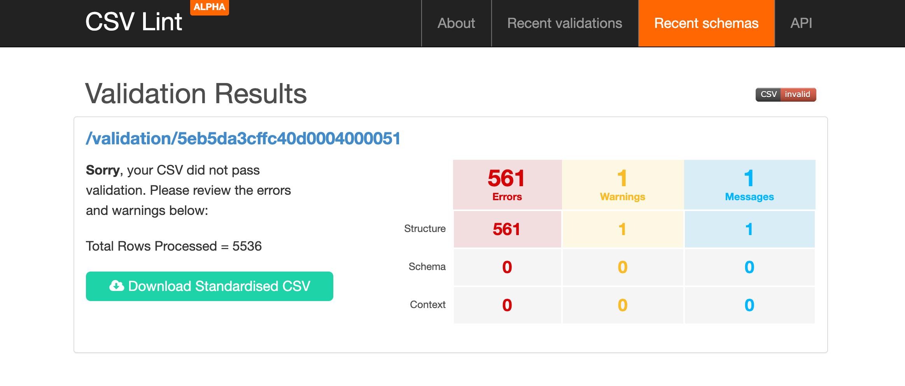
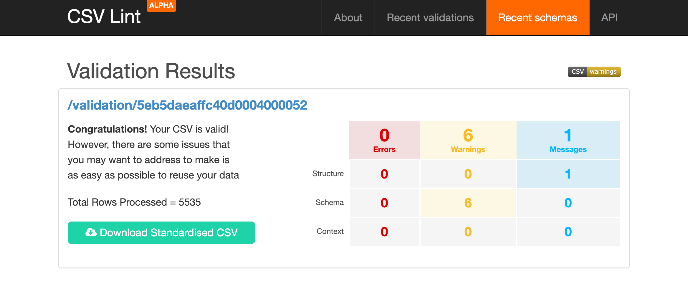

## 1. Datos abiertos para la toma de decisiones

Los datos abiertos son aquellos "datos que pueden ser utilizados, reutilizados y redistribuidos libremente por cualquier persona"^[https://opendatahandbook.org/guide/es/what-is-open-data/]. Para el tema de políticas públicas, los datos abiertos permiten la participación de actores diferentes a los actores de gobierno. Esto se hace aún más importante  en situaciones críticas donde se necesita desarrollar soluciones colectivas sobre problemas complejos, como en la actual crisis por el coronavirus. 

Una de los problemas centrales de la presente crisis consiste en compatibilizar la necesidad de guardar distanciamiento para evitar el contagío con la necesidad de realizar nuestras actividad laborales, educativas y sociales. Aquí el Internet juega un factor clave. Pero para ello es necesario saber de antemano en qué situación nos encontramos al respecto para tomar decisiones acertadas. 

Sobre el tema de Internet y TIC, en nuestro país, el 2017 el gobierno lanzó una importante encuesta sobre Tecnologías de Información y Comunicación en Bolivia, la primera de su tipo. Un reporte inicial de los resultados se puede encotrar en el portal de la  [AGETIC](https://www.agetic.gob.bo/pdf/ResultadosFinalesEncuestaTIC.pdf) y los datos fueron públicados en [repositorio de datos abiertos del Estado](https://datos.gob.bo/dataset/encuesta-nacional-de-opinion-sobre-tic).

Sin embargo, a la hora de procesarlos hemos encontrado varios problemas en el dataset publicado respecto a su formato.

## 2. Problemas con el formato del dataset

Encontramos tres problemas:

 - Dificultad de cargar los datos con software libre
 - Formato de CSV invalido
 - Falta de semántica en sus variables y valores 
 
### 2.1. Cargando el dataset

Descargamos el dataset en formato CSV del [repositorio](https://datos.gob.bo/dataset/encuesta-nacional-de-opinion-sobre-tic) mencionado y realizamos los siguientes intentos de carga.

#### Primer intento con la función `read.csv()` en `R`

Nuestro primer intento con la ya algo anticuada pero todavía confiable función de `read.csv()` en R nos arroja lo siguiente:

```{r}
base_r <- read.csv("base-5536-bdfinalcorregido.csv")
```

Los datos no cargan y nos produce un error que afirma que existen más columnas que nombres de columnas...

#### Segundo intento con `read_csv()` de la librería `readr` en `R`

Ahora usamos el mucho más joven `read_csv()` que es más rápida y coerciona menos los tipos de datos:

```{r}
library(readr)
base_r <- read_csv("base-5536-bdfinalcorregido.csv")
```

Más alla de los tipos de datos de las columnas que luego pueden especificarse, esta vez los datos cargan. Parece funcionar, aunque con algunas fallas...

Vemos la cabeza de nuestro dataset y nos encontramos con:

```{r}
head(base_r, 2)
```

¡Pesadilla!. Cargó, pero la situción es mucho peor.

Intentemos con Python.

#### Tercer intento con `read_csv()` de la libreria `pandas` de `Python`

A pesar de que hay cierta hostilidad entre las comunidades de R y Python, aquí en el Lab nos llevamos bien con ambos. 

```
import pandas as pd
base_p = pd.read_csv("base-5536-bdfinalcorregido.csv")
print(base_p.head(5))
```
```{python echo=TRUE}
import pandas as pd
base_p = pd.read_csv("base-5536-bdfinalcorregido.csv")
print(base_p.head(5))
```

No logró cargar y otra vez error...

#### Solución

Inspeccionando el dataset más de cerca, vemos que el problema es que lleva como delimitador un `;` en vez de `,`. Este pequeño detalle nos ha ocasionado los problemas hasta ahora vistos. Usando la función `read_delim` en `R` o el parametro `sep`en `pandas` logramos cargar los datos.

```{r}
library(readr)
base_r <- read_delim("base-5536-bdfinalcorregido.csv", delim = ";")
head(base_r, 5)
```

Ahora con Python: 

```
base_p = pd.read_csv("base-5536-bdfinalcorregido.csv", sep=";")
print(base_p.head(5))
```
```{python echo=TRUE}
base_p = pd.read_csv("base-5536-bdfinalcorregido.csv", sep=";")
print(base_p.head(5))
```

Si bien es cierto que este problema puede ser trivial para algunos, la idea de los datos abiertos es que tengan la mayor accesibilidad posible y puedan ser inmediatamente utilizados sin mayor problema de acceso. Y para eso deben ser validos, segun estandares y especificaciones.

### 2.2. CSV no valido

Más allá de su solución via parametros adicionales en el código, el problema central tiene que ver con que se ha publicado un CSV no valido. Subiendo este dataset a la herramienta de validación [CSVlint](https://csvlint.io/) del Open Data Institute, confirmamos esta situación:



### 2.3. Valores sin semántica 

¡Ya lo tenemos cargado! Ahora vamos a analizarlo, ¿qué podría salir mal? Exploremos. 

Veamos la estructura del dataset:

```{r}
str(base_r)
```

Aquí tenemos un problema de semántica. Las variables no poseen nombres entendibles y los valores tampoco. No podemos hacer preguntas directas a la base de datos, ni siquiera sobre cosas tan básicas como la edad o el sexo. Intentemos con un diagrama de barras de la P3:

```{r}
library(ggplot2)
  ggplot(base_r, aes(P3)) +
  geom_bar()
```

La visualización no muestra ni el nombre de la pregunta (solo P3), como tampoco los valores interpretables, (solo 1, 2, 3, 4). Si bien en el repositorio gubernamental se acompaña un diccionario de datos en PDF, este no es directamente utilizable en el procesamiento de los datos y tampoco es un formato abierto. Es necesario contar con las etiquetas de las variables y los valores para poder hacer una mejor interpretación y visualización de los datos. 

## 3. Una versión propia, valida y semántica

Hemos dado una solución a los problemas de (1) validación de formato, que llevan a problemas en el cargado de los mismos, y (2) a la semántica de variables y valores. 

Las versiones que subimos a nuestro repositorio son CSV validos: 



En nuestro repositorio pueden encontrar la misma versión no semántica del CSV publicado por el gobierno, pero con formato CSV Valido (`datos_valores.csv`) y acompañado de dos tablas CSV para las etiquetas de las variables (`etiquetas_variables.csv`) y de los valores (`etiquetas_valores.csv`).

Sobre la semántica damos dos soluciones. La primera es una versión totalmente etiquetada tanto en variables y valores (`datos_etiquetas_todo.csv`). Esta es la versión que se puede usar hacer análisis exploratorio con paquetes como Calc, Excel o Google Sheets. Tiene esta apariencia:

```{r}
base_etiquetada <- read_csv("csv/eti/datos_etiquetas_todo.csv")
head(base_etiquetada, 5)

```


La segunda es mediante un dataset (`base.csv`) asociado a un diccionario (`dic.csv`), donde las etiquetas del diccionario pueden asociarse con los atributos de los datos mediante R o Python.

En los siguientes días sacaremos reportes de varias dimensiones de Internet y sociedad a partir  de estos datos. Pero con los datos abiertos, tú también puedes hacerlo.

El repositorio se encuentra [aquí].
